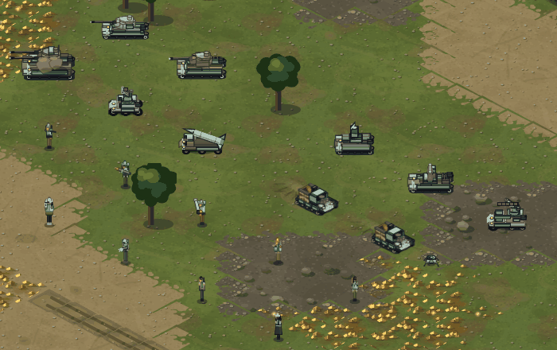
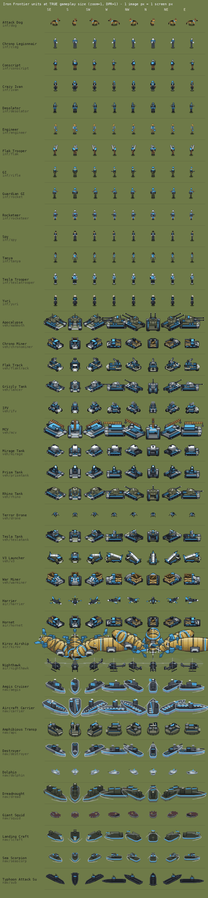
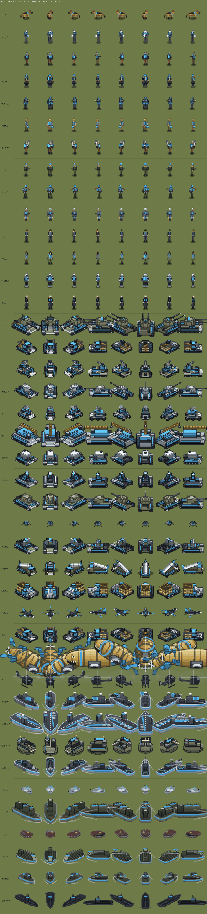
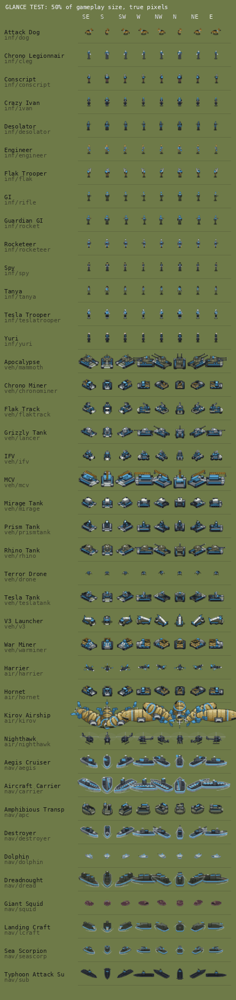
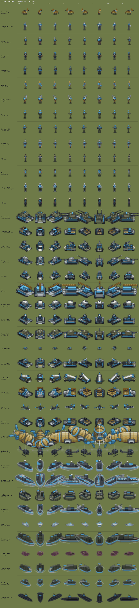
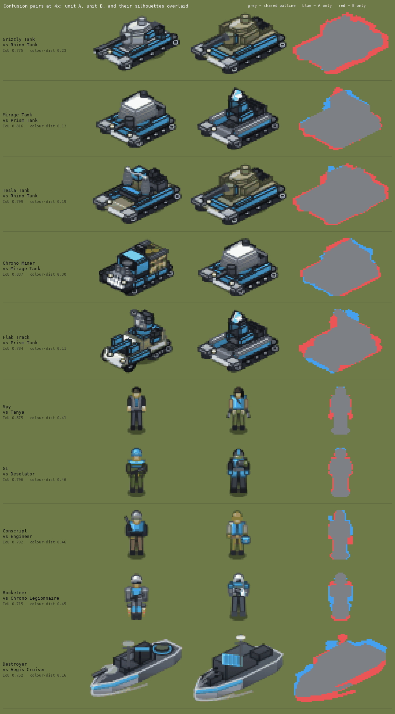
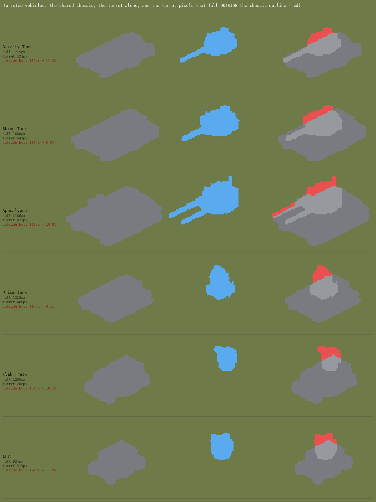

# Unit confusability audit — measured, at true gameplay zoom

Measured 2026-09-04 against `apps/games/rts/rts.html` @ 31 823 lines (branch `main`).
Every number below comes from real pixels read back out of the page's own baked
sprite atlas (`window.__rtsTest.spr()`) in headless Chromium at `devicePixelRatio = 1`,
composed exactly the way `drawUnit` composes them, and from one real rendered
in-game frame. Nothing here is from reading the source and guessing.

---

## VERDICT

**Yes — the complaint is correct, and it is measurable.** At the size a unit
actually occupies on screen, the thirteen ground vehicles share one silhouette
with a small ornament on top: the mean pairwise silhouette IoU across the nine
ground *combat* vehicles is **0.679**, and eight of those thirty-six pairs are
over 0.75. **Nine pixels** of a Grizzly Tank — 0.6 % of it — fall outside the
outline of a Rhino Tank. **Eleven of the thirteen** ground vehicles have at
least one *other* vehicle whose silhouette matches them better than they match
*themselves* seen from a different bearing, and for the Grizzly, Rhino, Flak
Track and V3 that is true of **nine of their twelve peers**. The mechanism is
not a shortage of detail; it is that the detail is in the wrong place and the
wrong colour. Every ground vehicle is built on the same rounded track-box
lozenge, and the only part that differs — the turret, mast, emitter or bin it
carries above that chassis — is **4–16 % of its pixels (56–282 px)**; on the six
vehicles where the turret is a separate baked layer, it contributes only
**8.1–11.9 % of the outline**. Meanwhile the one loud, saturated thing on every
one of them is the *same* thing: the owner-colour flank band, 13–19 % of a line
tank, while everything else is a neutral grey or olive — non-owner chroma is as
little as **3–6 %** of the sprite on the Apocalypse, Rhino, Mirage, Tesla and
Grizzly. The
"fixed ACCENT colour that says what it is" fails its own job: nine of the
thirteen ground vehicles picked a near-neutral grey, and for each of those nine
**all twelve** of its peers carry that same colour family.

Infantry are worse in a different way — all thirteen kinds
are the same 16–21 × 34–39 px figure (mass spread ×1.39, versus ×13.4 across the
vehicles), and turning the colour off collapses 36 % of what separates them.
This **confirms the stated hypothesis**: per-unit fidelity went up while the
set's shared vocabulary — a lozenge chassis, one blue band, one small grey
crown — swallowed mutual distinguishability. It **refutes one part of it**:
aspect ratio is *not* where the convergence happened (the vehicles span 1.01 to
1.53 and the roadmap's per-unit aspects sit close to their RA2 references), and
infantry facings, which `docs/gap-audit-art.md` §2 records as absent, now exist
and work.

---

## Method — what "gameplay zoom" means here

- `TW = 64, TH = 32` (rts.html:747), `zoom` starts at **1** (rts.html:24994) and
  the wheel clamps it to `ZMIN = 0.55 … ZMAX = 2.0` (rts.html:24995).
- Sprites are baked into a 104 × 90 canvas with the on-screen scale already
  applied inside the bake (`USC_I = 1.22`, `USC_V = 1.46`, rts.html:4176), and
  `drawUnit` blits them **1:1** (`ctx.drawImage(s.c, ox, oy, s.w * uk, s.h * uk)`,
  rts.html:29459, `uk = 1` for everything except the Kirov's 1.3).
  So the baked logical pixels **are** the screen pixels at zoom 1. On a HiDPI
  display `mkCanvas` multiplies by DPR but `drawImage` still uses logical
  width/height, so the physical size on screen is identical.
- Composition mirrors `drawUnit` exactly: hull + turret for the six turreted
  vehicles, envelope + gondola for the Kirov, `art.fr('stand', face, 0)` for
  infantry, single sheet for everything else. Healthy, idle, undisguised.
- **41 unit types × 8 bearings = 328 sprites**, each unit rendered in its own
  faction's art (`UNITS[key].fac`), player 0 (blue `#4aa3db`). Every bake
  returned pixels; **no bake threw and no sprite came back empty**.
- The 50 % "glance" sheet is not hypothetical: **0.55 is the game's own minimum
  zoom**, so 50 % is inside what a player can do with the wheel.

Metrics: silhouette IoU on the alpha mask after centring on the bbox centre
(mean over the 8 bearings unless said otherwise); bbox aspect `w/h`; pixel mass
= count of `alpha > 8`; colour distance = ½·L1 over a 6×6×6 RGB histogram of the
opaque pixels (0 = identical, 1 = disjoint).

---

## 1. Contact sheets

### A real rendered frame first

Twenty-four units of one side standing on plain ground, one common bearing,
zoom 1, screenshotted out of the live renderer — not the bake canvas.



### The whole roster at true gameplay size

One image pixel = one screen pixel. Columns are the eight screen bearings
(SE, S, SW, W, NW, N, NE, E); rows are grouped infantry → vehicles → air → naval.



The same pixels through a 4× nearest-neighbour loupe — **no new detail, this is
what the sheet above contains**:



### The glance test — 50 % of gameplay size





---

## 2. Pairwise confusability

820 pairs measured. Group summary:

| group | units | pairs | mean IoU | median | max | pairs IoU > 0.75 | mean IoU @50 % | mean colour dist |
|---|---:|---:|---:|---:|---:|---:|---:|---:|
| ground vehicles | 13 | 78 | 0.581 | 0.671 | 0.837 | 13 | 0.580 | 0.269 |
| infantry | 14 | 91 | 0.644 | 0.666 | 0.875 | 17 | 0.660 | 0.462 |
| naval | 10 | 45 | 0.478 | 0.517 | 0.752 | 1 | 0.483 | 0.534 |
| air | 4 | 6 | 0.302 | 0.290 | 0.586 | 0 | 0.308 | 0.578 |
| **ground combat vehicles only** (Grizzly, Rhino, Apocalypse, Mirage, Prism, Tesla, Flak Track, IFV, V3) | 9 | 36 | **0.679** | — | 0.816 | **8** | — | **0.207** |

Note what does *not* change: **IoU at 50 % zoom is the same as at 100 %** in every
group. Halving the size does not make anything worse because there was nothing
in the extra pixels to lose.

### Most-confusable pairs — ground vehicles

| A | B | IoU | IoU @50 % | max over bearings | Δaspect | mass ratio | colour dist |
|---|---|---:|---:|---:|---:|---:|---:|
| Chrono Miner | Mirage Tank | **0.837** | 0.823 | 0.856 | 0.026 | 0.942 | 0.304 |
| Mirage Tank | Prism Tank | **0.816** | 0.821 | 0.905 | 0.136 | 0.988 | **0.129** |
| Mirage Tank | Tesla Tank | **0.813** | 0.808 | 0.863 | 0.094 | 0.908 | 0.187 |
| Rhino Tank | Tesla Tank | 0.799 | 0.796 | 0.883 | 0.073 | 0.859 | 0.194 |
| War Miner | Tesla Tank | 0.798 | 0.787 | 0.818 | 0.093 | 0.871 | 0.328 |
| War Miner | Rhino Tank | 0.790 | 0.775 | 0.830 | 0.165 | 0.986 | 0.340 |
| Chrono Miner | Tesla Tank | 0.787 | 0.747 | 0.861 | 0.068 | 0.855 | 0.234 |
| War Miner | Mirage Tank | 0.787 | 0.786 | 0.818 | **0.001** | 0.790 | 0.363 |
| Flak Track | Prism Tank | 0.784 | 0.784 | 0.825 | 0.098 | 0.924 | **0.114** |
| Tesla Tank | Prism Tank | 0.781 | 0.766 | 0.863 | 0.230 | 0.919 | **0.126** |
| Grizzly Tank | Rhino Tank | 0.775 | 0.784 | 0.792 | 0.067 | 0.785 | 0.229 |
| Grizzly Tank | Tesla Tank | 0.753 | 0.746 | 0.857 | 0.140 | 0.913 | 0.169 |

**Name names.** By measurement these are nearly the same shape at gameplay zoom:
**Mirage / Prism / Tesla / Flak Track** (a four-way tangle, every pair ≥ 0.78 and
colour distance ≤ 0.19), **Grizzly / Rhino** (the two factions' line tanks),
**Rhino / Tesla**, and **both harvesters against most of the tank line** (Chrono
Miner ↔ Mirage 0.837 is the single worst pair in the game).

### Most-confusable pairs — infantry

| A | B | IoU | IoU @50 % | max | Δaspect | mass ratio | colour dist |
|---|---|---:|---:|---:|---:|---:|---:|
| Tanya | Spy | **0.875** | 0.867 | 0.886 | 0.014 | 0.899 | 0.410 |
| Tanya | Crazy Ivan | **0.858** | 0.908 | 0.876 | 0.014 | 0.883 | 0.360 |
| Engineer | Crazy Ivan | 0.819 | 0.789 | 0.838 | 0.026 | 0.906 | 0.414 |
| Engineer | Tanya | 0.806 | 0.807 | 0.822 | 0.012 | 0.975 | 0.423 |
| GI | Desolator | 0.796 | 0.765 | 0.873 | 0.028 | 0.903 | 0.461 |
| Conscript | Engineer | 0.792 | 0.807 | 0.884 | 0.028 | 0.990 | 0.459 |
| Guardian GI | Desolator | 0.791 | 0.845 | 0.885 | 0.027 | 0.977 | 0.277 |
| Conscript | Spy | 0.782 | 0.771 | 0.856 | 0.030 | 0.868 | 0.322 |
| GI | Chrono Legionnaire | 0.777 | 0.733 | 0.839 | **0.001** | 0.978 | 0.586 |

### The control that settles it: a unit against *itself*

If two different units overlap better than one unit overlaps its own sprite at
another bearing, the pair is not distinguishable by shape at all.

| unit | group | self-IoU (own 8 bearings) | nearest other unit | their IoU | peers that beat self-similarity |
|---|---|---:|---|---:|---:|
| Grizzly Tank | vehicle | 0.591 | Rhino Tank | **0.775** | **9 / 12** |
| Flak Track | vehicle | 0.661 | Prism Tank | **0.784** | **9 / 12** |
| Rhino Tank | vehicle | 0.656 | Tesla Tank | **0.799** | **9 / 12** |
| V3 Launcher | vehicle | 0.588 | Grizzly Tank | 0.702 | **9 / 12** |
| Tesla Tank | vehicle | 0.691 | Mirage Tank | **0.813** | 7 / 12 |
| Chrono Miner | vehicle | 0.726 | Mirage Tank | **0.837** | 5 / 12 |
| War Miner | vehicle | 0.730 | Tesla Tank | 0.798 | 5 / 12 |
| Prism Tank | vehicle | 0.738 | Mirage Tank | **0.816** | 5 / 12 |
| Mirage Tank | vehicle | 0.779 | Chrono Miner | **0.837** | 4 / 12 |
| Apocalypse | vehicle | 0.652 | MCV | 0.735 | 3 / 12 |
| MCV | vehicle | 0.654 | Apocalypse | 0.735 | 1 / 12 |
| IFV | vehicle | 0.709 | Flak Track | 0.702 | 0 / 12 |
| Terror Drone | vehicle | 0.787 | IFV | 0.211 | 0 / 12 |
| GI | infantry | 0.655 | Desolator | 0.796 | **11 / 13** |
| Desolator | infantry | 0.661 | GI | 0.796 | 7 / 13 |
| Guardian GI | infantry | 0.573 | Desolator | 0.791 | 7 / 13 |
| Flak Trooper | infantry | 0.680 | Desolator | 0.740 | 6 / 13 |
| Conscript | infantry | 0.728 | Engineer | 0.792 | 5 / 13 |
| Engineer | infantry | 0.770 | Crazy Ivan | 0.819 | 5 / 13 |
| Chrono Legionnaire | infantry | 0.736 | GI | 0.777 | 5 / 13 |

Totals: **11 / 13 ground vehicles, 11 / 14 infantry and 8 / 10 ships** have at
least one peer that matches them better than their own other bearings do.
**0 / 4 aircraft** do — the air layer is the one group that is fine.

### Symmetric difference — how much of a unit is not inside its look-alike

| pair | IoU | A-only px | B-only px | shared px | A-only % of A |
|---|---:|---:|---:|---:|---:|
| **Grizzly Tank / Rhino Tank** | 0.775 | **9** | 403 | 1428 | **0.6 %** |
| **Spy / Tanya** | 0.875 | **4** | 39 | 302 | **1.4 %** |
| Tesla Tank / Rhino Tank | 0.799 | 63 | 321 | 1510 | 4.0 % |
| Mirage Tank / Tesla Tank | 0.813 | 84 | 229 | 1344 | 5.9 % |
| Chrono Miner / Mirage Tank | 0.837 | 81 | 164 | 1264 | 6.0 % |
| GI / Desolator | 0.796 | 22 | 59 | 322 | 6.4 % |
| Flak Track / Prism Tank | 0.784 | 112 | 222 | 1223 | 8.4 % |
| Mirage Tank / Prism Tank | 0.816 | 140 | 157 | 1288 | 9.8 % |
| Conscript / Engineer | 0.792 | 43 | 39 | 311 | 12.1 % |
| Destroyer / Aegis Cruiser | 0.752 | 167 | 312 | 1468 | 10.2 % |



---

## 3. Per-unit identity feature inventory

### 3a. The exact measurement, where an exact one is possible

Six vehicles bake hull and turret as separate layers, so the identity part can be
measured with no interpretation at all. The turret is the *only* thing that
differs between these six.

| unit | hull px | turret px | turret % of unit | turret px **outside** the hull outline | % of the unit's outline |
|---|---:|---:|---:|---:|---:|
| Apocalypse | 2166 | 877 | 36.1 % | 262 | **10.8 %** |
| Rhino Tank | 1680 | 642 | 35.1 % | 152 | **8.3 %** |
| Grizzly Tank | 1275 | 521 | 36.3 % | 162 | **11.3 %** |
| Prism Tank | 1328 | 400 | 27.7 % | 117 | **8.1 %** |
| IFV | 924 | 319 | 30.5 % | 124 | **11.9 %** |
| Flak Track | 1200 | 286 | 21.4 % | 134 | **10.1 %** |

Hull-only pairwise IoU across those six: **mean 0.683** (min 0.424 Apocalypse/IFV,
max 0.848 Flak Track/Prism). Turret-only pairwise IoU: mean 0.444. The chassis is
68 % shared and carries 88–92 % of the outline; the part that names the tank
carries 8–12 %.



### 3b. The superstructure budget for every ground vehicle

The "crown" = every pixel above the chassis (rule: the chassis is the bottom run
of rows at ≥ 55 % of the sprite's widest row). Validated against the six known
turrets above, where it recovers 26–64 % of the turret layer and tracks the
outside-the-hull figure closely.

| unit | total px | crown px | crown % | crown px at 50 % zoom | the feature that is supposed to name it |
|---|---:|---:|---:|---:|---|
| MCV | 2928 | 282 | 9.6 % | 71 | amber folded crane boom |
| Apocalypse | 2428 | 268 | 11.0 % | **67** | twin gun-black barrels |
| Rhino Tank | 1831 | 170 | 9.3 % | **42** | stubby gunmetal 120 mm |
| War Miner | 1806 | 115 | 6.4 % | 29 | tan slatted ore bin + gun |
| Tesla Tank | 1573 | 173 | 11.0 % | **43** | the two coil columns |
| Prism Tank | 1445 | 220 | 15.2 % | 55 | the upright prism block |
| Grizzly Tank | 1437 | 148 | 10.3 % | **37** | thin dark gun |
| Mirage Tank | 1428 | 177 | 12.4 % | **44** | ribbed white emitter stack |
| Chrono Miner | 1345 | 56 | 4.2 % | **14** | tan slatted ore bin |
| Flak Track | 1335 | 183 | 13.7 % | 46 | pale flak shield |
| V3 Launcher | 1314 | 157 | 11.9 % | 39 | the white rocket on the rail |
| IFV | 1048 | 172 | 16.4 % | 43 | boxy launcher housing |
| Terror Drone | 218 | 14 | 6.2 % | **3** | four blade legs |

This is the crux the brief asked for, and the answer is blunt: **a Chrono
Miner's whole superstructure is 56 px — 14 px at half zoom. A Grizzly's gun is 37 px at half
zoom. A Tesla Tank's coils are 43.** At those counts a feature is a texture, not
an identity.

### 3c. The ACCENT system does not carry identity

`rts.html:4179` states the design rule: *"the FACTION colour says whose it is, a
fixed ACCENT colour says what it is."* Measured, the second half does not hold.
For each unit, how many of its same-group peers also carry > 2 % of their own
mass in that unit's accent colour family (any `shade()` multiple of it):

| unit | accent | its own share | peers that also carry it |
|---|---|---:|---:|
| Grizzly Tank | `#3a3f4c` grey deck insets | 43.1 % | **12 / 12** |
| Rhino Tank | `#2b2f36` gunmetal barrel | 37.7 % | **12 / 12** |
| Mirage Tank | `#e9edf2` emitter stack | 33.2 % | **12 / 12** |
| Apocalypse | `#17181c` twin barrels | 31.0 % | **12 / 12** |
| IFV | `#e6eaf0` white lower body | 27.2 % | **12 / 12** |
| Prism Tank | `#dfe9f5` prism block | 22.8 % | **12 / 12** |
| Tesla Tank | `#dfe6ee` coil windings | 15.9 % | **12 / 12** |
| Terror Drone | `#a9b0bb` carapace | 14.9 % | **12 / 12** |
| Flak Track | `#d9dee5` flak shield | 13.6 % | **12 / 12** |
| V3 Launcher | `#e6e7e9` white rocket | 21.4 % | 11 / 12 |
| War Miner | `#b0955a` tan ore bin | 8.9 % | **1 / 12** |
| Chrono Miner | `#b0955a` tan ore bin | 6.0 % | **1 / 12** |
| MCV | `#e0a33c` amber crane | 4.7 % | **1 / 12** |
| Engineer | `#e8c33c` amber hard hat | 11.1 % | **0 / 13** |
| Desolator | `#4de04a` green rad muzzle | 3.9 % | **0 / 13** |
| Yuri | `#a86ff0` violet temples | 1.3 % | **0 / 13** |
| Conscript | `#8b929b` steel helmet | 11.6 % | 11 / 13 |
| Rocketeer | `#9aa3ae` steel flight suit | 50.0 % | 9 / 13 |
| Chrono Legionnaire | `#cfe4f5` bone-white dome | 23.0 % | 9 / 13 |
| Tesla Trooper | `#c3cbd6` steel helmet bowl | 34.3 % | 10 / 13 |
| Guardian GI | `#ffbe45` amber warhead | 0.3 % | 2 / 13 |
| Flak Trooper | `#ffbe45` amber shell drum | 1.1 % | 2 / 13 |

Two failure modes, both visible in that table. **Ten of thirteen** ground
vehicles picked a *near-neutral grey or white* as their identity accent — so the
"share" number is large only because it is matching the whole grey tank, and
every peer matches it too. The three vehicles with a genuinely chromatic accent
(the two miners' tan bin, the MCV's amber boom) are the three ground vehicles
that are *not* in the confusable cluster. Symmetrically, the three units whose
accent is unique in-group (Engineer amber, Desolator green, Yuri violet) are the
only ones with a chromatic accent, and two of them spend it on 4–15 px
(Guardian GI's amber warhead is **0.3 % — one pixel per bearing on average**).

### 3d. Owner colour is the loudest thing on every unit, and it is the same on all of them

Share of a unit's pixels that are the player's hue (within ±18° of `#4aa3db`,
saturation > 0.30), against the share that is *any* saturated colour at all:

| unit | owner hue | any chroma | non-owner chroma |
|---|---:|---:|---:|
| Apocalypse | 13.8 % | 16.8 % | **3.0 %** |
| Rhino Tank | 13.3 % | 17.7 % | **4.4 %** |
| Mirage Tank | 13.1 % | 18.2 % | **5.1 %** |
| Tesla Tank | 16.1 % | 21.1 % | **5.0 %** |
| Grizzly Tank | 16.0 % | 22.8 % | 6.8 % |
| V3 Launcher | 15.4 % | 23.8 % | 8.4 % |
| Prism Tank | 16.4 % | 27.8 % | 11.4 % |
| Flak Track | 19.0 % | 28.9 % | 9.9 % |
| IFV | 17.6 % | 29.3 % | 11.7 % |
| MCV | 27.3 % | 44.3 % | 17.0 % |
| Chrono Miner | 13.7 % | 48.3 % | 34.6 % |
| War Miner | 17.2 % | 56.7 % | 39.5 % |

On a line tank, roughly one pixel in seven is the owner's blue and **only three
to six pixels in a hundred are any other colour**. The two units at the bottom of
that table — the ones with 35–40 % non-owner chroma — are exactly the two that
read as themselves in the contact sheet. That is the measured mechanism: the
brightest, largest, most attention-grabbing mark on every ground vehicle is a
mark they all share.

---

## 4. The infantry finding

**First, a correction to the record.** `docs/gap-audit-art.md` §2 lists
"**Zero facings — every soldier always faces the camera**" as a blocker.
That is stale. `bakeInfantry(col, kind, fac, phase, dir, state)` (rts.html:4354)
takes a direction, `INF_OCT` maps grid facing to screen octant (rts.html:4287),
and `art.fr(state, dir, phase)` (rts.html:5698) resolves a 32-facing bearing to
one of eight SHP octants. Measured, the facings genuinely change the sprite:
self-IoU across a kind's own 8 bearings is 0.573 (Guardian GI) to 0.838 (Yuri),
i.e. as much bearing-to-bearing variation as the vehicles have. That gap is
closed.

**What is not fine.** All thirteen human kinds are the same figure:

| | value |
|---|---|
| bbox widths across all 13 kinds | **16, 18, 19, 20, 21 px** (five distinct values) |
| bbox heights | **34, 35, 36, 37, 38, 39 px** (six distinct values) |
| pixel mass | 307 (Spy) … 428 (Tesla Trooper) — a span of **×1.39** |
| mean pairwise silhouette IoU | **0.644** |
| pairs over 0.75 IoU | **17 / 91** |
| mean IoU at 50 % zoom | **0.660** — no worse, because there is nothing to lose |
| mean colour-histogram distance | 0.434 |
| mean **luminance-only** distance (colour turned off) | **0.280** — a **36 % collapse** |

**Plainly: infantry are distinguished mainly by colour, not by shape.** Turning
the hue off destroys more than a third of the separation between them, and what
remains is small. The closest pairs in greyscale:

| A | B | greyscale distance | silhouette IoU |
|---|---|---:|---:|
| Conscript | Spy | **0.090** | 0.782 |
| Crazy Ivan | Desolator | 0.107 | 0.666 |
| GI | Conscript | 0.137 | 0.656 |
| GI | Guardian GI | 0.153 | 0.678 |
| Guardian GI | Flak Trooper | 0.165 | 0.694 |
| Conscript | Flak Trooper | 0.168 | 0.657 |
| GI | Flak Trooper | 0.190 | 0.730 |

The worst single case is **Spy vs Tanya at IoU 0.875 with 4 px of the Spy
outside Tanya's outline** — a 1.4 % shape difference between the two most
consequential single-unit specials on the field. Note also that the accent that
should separate them is *itself* the owner colour on most kinds: GI 22.0 %,
Guardian GI 26.4 %, Engineer 25.7 %, Desolator 24.4 %, Crazy Ivan 22.8 % owner
hue, so the colour that does most of the separating work is partly the colour
that is supposed to say *whose*, not *what*.

The two infantry-group units that are genuinely distinct are the ones that are
not men: **Attack Dog** (a horizontal quadruped, nearest-peer IoU 0.450, 43 % of
its pixels unique) and to a lesser degree **Rocketeer** (jet pack, 0.715).

---

## 5. The size hierarchy

Mean pixel mass over 8 bearings, at gameplay zoom, whole roster sorted:

| unit | group | mass px | bbox (max) | aspect | owner hue |
|---|---|---:|---|---:|---:|
| Kirov Airship | air | 5938 | 172 × 114 | 1.58 | 22.7 % |
| MCV | vehicle | 2928 | 80 × 72 | 1.16 | 27.3 % |
| Aircraft Carrier | naval | 2839 | 111 × 64 | 1.63 | 16.9 % |
| **Apocalypse** | vehicle | **2428** | 84 × 63 | 1.33 | 13.8 % |
| Dreadnought | naval | 2425 | 99 × 65 | 1.53 | 12.2 % |
| Nighthawk | air | 2144 | 74 × 48 | 1.55 | 1.2 % |
| **Rhino Tank** | vehicle | **1831** | 73 × 53 | 1.46 | 13.3 % |
| War Miner | vehicle | 1806 | 63 × 49 | 1.30 | 17.2 % |
| Aegis Cruiser | naval | 1780 | 85 × 56 | 1.37 | 15.0 % |
| Amphibious Transport | naval | 1666 | 54 × 55 | 1.04 | 7.5 % |
| Destroyer | naval | 1635 | 89 × 57 | 1.53 | 14.6 % |
| **Tesla Tank** | vehicle | **1573** | 66 × 43 | 1.39 | 16.1 % |
| Hornet | air | 1482 | 61 × 43 | 1.45 | 12.9 % |
| **Prism Tank** | vehicle | **1445** | 61 × 48 | 1.16 | 16.4 % |
| **Grizzly Tank** | vehicle | **1437** | 75 × 51 | 1.53 | 16.0 % |
| **Mirage Tank** | vehicle | **1428** | 59 × 42 | 1.30 | 13.1 % |
| Landing Craft | naval | 1373 | 63 × 44 | 1.49 | 13.2 % |
| Chrono Miner | vehicle | 1345 | 55 × 42 | 1.32 | 13.7 % |
| **Flak Track** | vehicle | **1335** | 53 × 47 | 1.06 | 19.0 % |
| **V3 Launcher** | vehicle | **1314** | 61 × 50 | 1.29 | 15.4 % |
| **IFV** | vehicle | **1048** | 47 × 44 | 1.01 | 17.6 % |
| Typhoon Attack Sub | naval | 1009 | 81 × 44 | 1.80 | 3.2 % |
| Sea Scorpion | naval | 934 | 55 × 34 | 1.44 | 20.1 % |
| Giant Squid | naval | 569 | 40 × 25 | 1.60 | 0.0 % |
| Harrier | air | 495 | 45 × 33 | 1.69 | 23.5 % |
| Tesla Trooper | infantry | 428 | 21 × 39 | 0.40 | 19.1 % |
| Attack Dog | infantry | 420 | 39 × 28 | 1.06 | 3.8 % |
| Flak Trooper | infantry | 413 | 20 × 37 | 0.49 | 17.7 % |
| Dolphin | naval | 394 | 39 × 25 | 1.48 | 6.4 % |
| Guardian GI | infantry | 390 | 21 × 37 | 0.53 | 26.4 % |
| Crazy Ivan | infantry | 386 | 20 × 35 | 0.44 | 22.8 % |
| Desolator | infantry | 381 | 19 × 36 | 0.51 | 24.4 % |
| Yuri | infantry | 379 | 16 × 38 | 0.38 | 9.1 % |
| Rocketeer | infantry | 357 | 18 × 34 | 0.49 | 18.5 % |
| Conscript | infantry | 354 | 18 × 36 | 0.44 | 17.8 % |
| Chrono Legionnaire | infantry | 352 | 18 × 35 | 0.48 | 19.6 % |
| Engineer | infantry | 350 | 18 × 36 | 0.42 | 25.7 % |
| GI | infantry | 344 | 19 × 36 | 0.48 | 22.0 % |
| Tanya | infantry | 341 | 18 × 35 | 0.43 | 17.8 % |
| Spy | infantry | 307 | 16 × 35 | 0.41 | 4.8 % |
| Terror Drone | vehicle | 218 | 26 × 18 | 1.34 | 18.3 % |

**There is a hierarchy at the extremes and none in the middle.** Across the whole
vehicle class the span is ×13.4 (Terror Drone 218 → MCV 2928), which is healthy.
But the nine ground **combat** vehicles — the ones a player is actually reading
in a fight — span only **×2.3** (IFV 1048 → Apocalypse 2428), and six of them
sit inside a **×1.38 band from 1048 to 1445**. A Conscript to an Apocalypse is
×6.9, which is a real hierarchy; a Grizzly to an Apocalypse is ×1.69 and a
Flak Track to a Mirage to a Grizzly to a Prism is ×1.08 end to end.

Infantry have no hierarchy at all: ×1.39 across thirteen kinds, in a 5-value
width range and a 6-value height range.

---

## Where this confirms the hypothesis, and where it does not

**Confirms.** The art pass described in `apps/games/rts/docs/roadmap.md` §Grizzly /
Rhino / Mirage / Tesla / Prism did exactly what the brief suspected. Each entry
moved a *loud, unit-specific* mark toward a *quiet, shared* one — three-segment
skirt → one unbroken band (Grizzly), coloured turret cheeks → hull value (Rhino),
four white plates → three with only the top in accent (Mirage), full-height
colour core → hull with a cap (Tesla), six flank dominoes → one plate (Prism) —
and drove owner hue into a common band. The measured result is a set with 68 %
shared chassis, 8–12 % of the outline carrying the identity, and ten of thirteen
vehicles whose "identity accent" is a grey their peers all share. Per-unit
fidelity rose; set-level distinguishability fell.

**Does not confirm — aspect ratio.** The brief's phrasing implies the units
converged on "a similar aspect ratio". They did not. Measured over 8 bearings the
ground vehicles span 1.01 (IFV) to 1.53 (Grizzly), and the roadmap's own
single-facing aspects sit within a few percent of their RA2 references (Grizzly
1.62 vs 1.62, Rhino 1.59 vs 1.57, Apocalypse 1.42 vs 1.41, Mirage 1.41 vs 1.36).
Aspect fidelity is genuinely good. The convergence is in **outline shape, colour
budget and mass**, not in proportion.

**Does not confirm — infantry facings.** They exist and work (§4). The stale
line in `docs/gap-audit-art.md` §2 should be struck.

**Also worth recording.** The **air layer is the counter-example that proves the
diagnosis**: four aircraft, mean pairwise IoU 0.302, zero pairs over 0.75, and
**not one** of them beaten by a peer on the self-similarity control. They are the
one group that does not sit on a shared chassis, and they are the one group that
is not confusable. The naval group is intermediate (mean 0.478) but eight of ten
still lose the self-similarity control.

---

## What this implies for a fix (not the plan — that is someone else's)

The measurements point at four levers, in descending order of measured effect.

1. **The shared chassis is the problem, not the ornament.** 88–92 % of a tank's
   outline is a lozenge that six vehicles share at hull-IoU 0.683. Any change
   confined to the turret is spending its effort on 8–12 % of the silhouette.
2. **The identity budget is currently 117–268 px (29–71 px at the game's own
   minimum zoom).** Whatever names a unit has to be bigger than that, or has to
   be placed where it breaks the outline rather than sitting inside it.
3. **The one saturated mark on every unit is the mark they all share.** Owner
   hue is 13–19 % of a line tank while non-owner chroma is 3–6 %. The three
   ground vehicles that are *not* in the confusable cluster (both miners, the
   MCV) are exactly the three with 17–40 % non-owner chroma.
4. **Infantry need mass and outline separation, not more colour.** They already
   lean on colour for 36 % of what separates them, and they sit in a ×1.39 mass
   band with five distinct widths across thirteen kinds.

---

## Reproducing

No product code was modified. The harness is standalone:

```bash
# serve the page (rts.html plus shared/gamescore.js, shared/vibe-modal.js)
python3 -m http.server 8099 --bind 127.0.0.1

# scripts used (scratch): extract.js (328 sprites -> RGBA), layers.js (hull/turret
# layers), scene.js (live frame), analyse*.py (metrics), sheets.py / figs.py (sheets)
```

The existing repo harness under `apps/games/rts/art/` (`_pw.js`, `usheet.js`,
`vsheet.js`, `airsheet.js`) reads the same `window.__rtsTest.spr()` atlas and is
the natural place to land any of this permanently.
